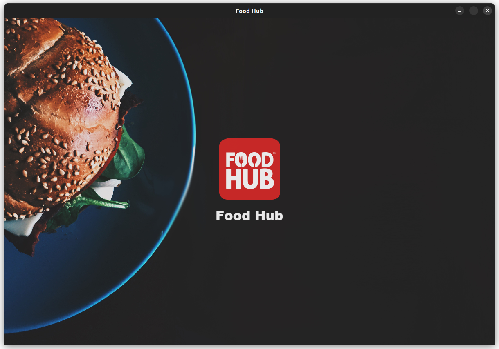
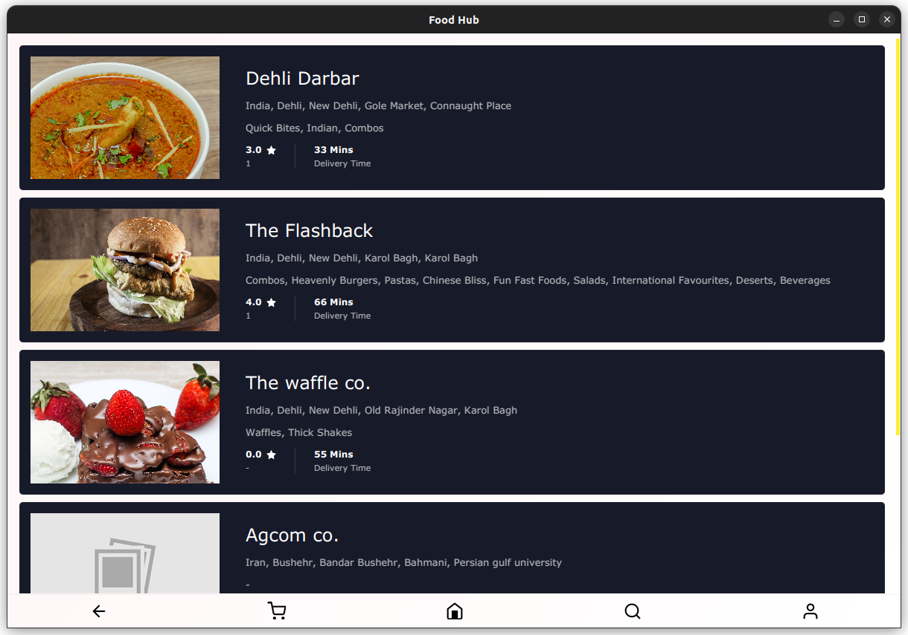
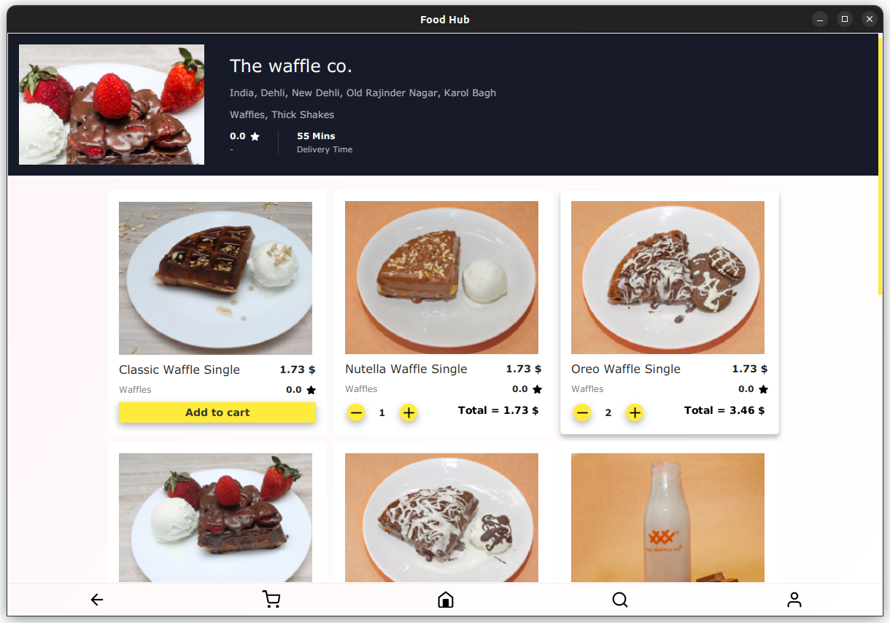
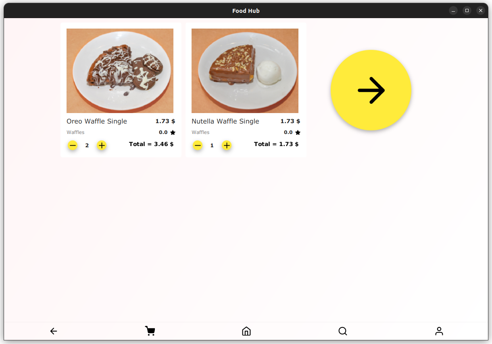
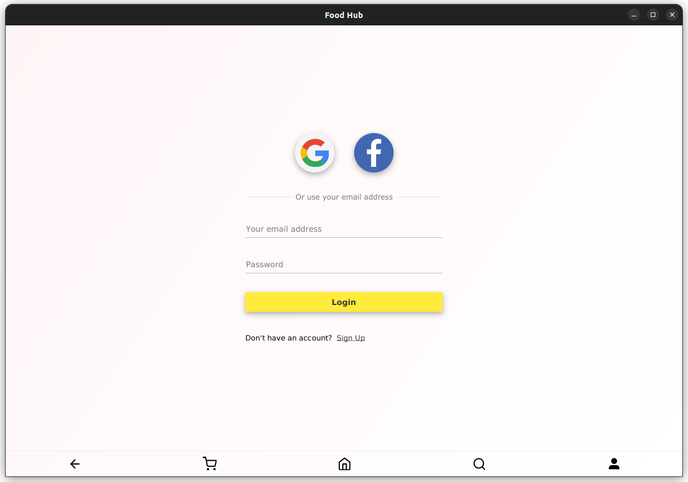
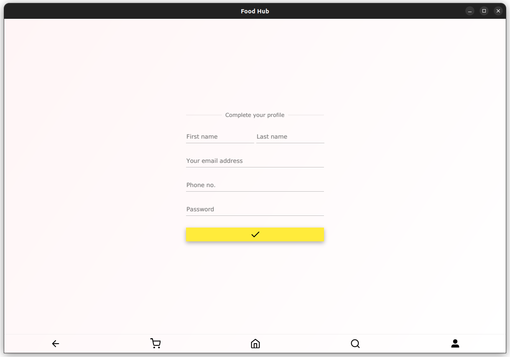
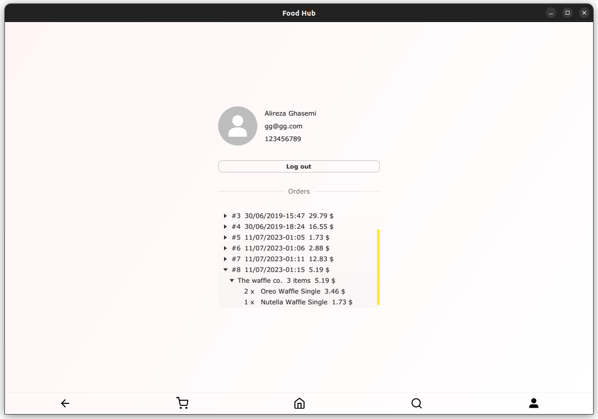

:warning: Not maintained, BUT, feel free to fork it. :warning:

# FoodHub

A [SnappFood](https://snappfood.ir/about) (or [UberEats](https://about.ubereats.com/)) clone in JavaFX; see [screenshots](#screenshots) at the end of this document.

This application was my final's project for the **advanced programming** university course, originally made in **2019**.

> You can also check out **Foodo** in [here](./Foodo); FoodHub's abandoned predecessor.

## Simple build & run

```shell
# On a Linux OS
./gradlew run
```

```powershell
# Or if you are on Windows:
./gradlew.bat run
```

## Issues

This project is not empty of issues! I just never put/had the time to list them.

## Disclaimer

The example databases' data and the images are not mine; I found them on the Internet using Google search engine.

## Screenshots
















> See the full initial design brain-storm [here](./Initial%20design%20brain-storm.pdf).
